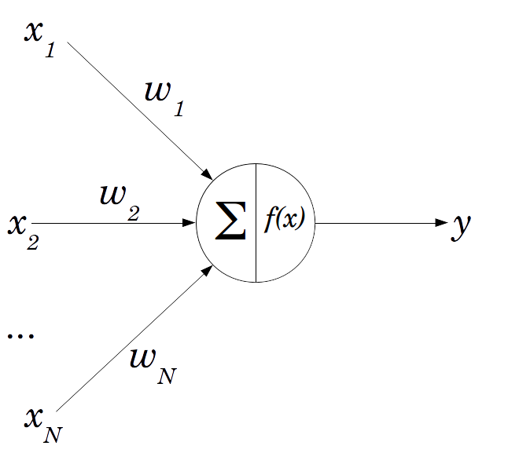

```{r setup, include=FALSE}

knitr::opts_chunk$set(echo = TRUE, warning = FALSE, message = FALSE)

```

## Introdução

Uma explicação básica e teórica do funcionamento de uma rede neural simples. O conteúdo teórico foi extraído [daqui](https://www.lucidarme.me/simplest-perceptron-update-rules-demonstration/).

### Perceptron

A seguir a rerpesentação de um único perceptron com uma função de transferência dada por $f(x) = x$

<center>
{width=40%}
</center>

### Função de transferência

A função de transferência é dada por:

$$y = w_1x_1 + \dots  + w_Nx_N = \sum_{i=1}^N w_ix_i$$

### Erro (custo)

Em redes neurais artificiais o objetivo é minimar o erro dado por:

$$E = (y' - y)^2$$

- $E$: erro
- $y'$: valor esperado pós treino
- $y$: valor observado

Para termos práticos o erro é dividido por 2, ficando:

$$E = \frac{(y' - y)^2}{2}$$

### Gradiente descendente

O algoritmo utilizado para treinar e assim atualizar os pesos de forma ótima é o **gradiente descendente**. O modelo é descrito abaixo:

$$w'_i = w_i - \eta \frac{dE}{dw_i}$$

  - $w_i$: peso antes da atualização
  - $w'_i$: peso após a atualização
  - $\eta$: taxa de aprendizado

A derivada do erro é $-(y'-y)x_i$, verifica-se a demonstração [aqui](https://www.lucidarme.me/simplest-perceptron-update-rules-demonstration/).

Então a atualização dos pesos via gradiente descendente fica:

$$w'_i = w_i - \eta \frac{dE}{dw_i} = w_i + \eta (y' - y)x_i$$

Conclusão:

$$w'_i = w_i + \eta (y' - y)x_i$$

## Aplicação

A seguir uma [aplicação](https://www.r-bloggers.com/understanding-the-magic-of-neural-networks/) para ilustrar o funcionamento de uma rede com apenas um neurônio.

### Dados

```{r}

require(dplyr)
require(magrittr)
require(ggplot2)
require(plotly)

dataset <- tibble(input1 = c(1, 0, 1, 0),
                  input2 = c(0, 0, 1, 1),
                  output = c(0, 1, 0, 1))

```

O conjunto de dados

```{r}

dataset %>% DT::datatable(rownames = FALSE, 
                          options = list(dom = "t"),
                          colnames = c("Input 1", "Input 2", "Output"))

```

O conjunto de dados no espaço bidimensional

```{r}

g1 <- dataset %>% 
   ggplot() +
   aes(input1, input2, colour = as.factor(output)) +
   geom_point(size = 5) +
   scale_x_continuous(limits = c(-.5, 1.5)) +
   scale_y_continuous(limits = c(-.5, 1.5)) +
   labs(x = "Input 1", y = "Input 2", colour = "") +
   theme_minimal()

ggplotly(g1, tooltip = "") %>% 
  config(displayModeBar = FALSE)

```


### Exemplo

```{r}

input <- dataset %>% as.matrix() %>% .[, 1:2] # input
input %<>% cbind(bias = 1) # inclusão do viés (intercepto)
output <- dataset %>% pull(output) # vetor de output

```

O neurônio é definido pela função:

```{r}

neuron <- function(input, weights) as.vector(ifelse(input %*% weights > 0, 1, 0))

```

Informações adicionais para o otimizador:

```{r}

weights <- c(0.25, 0.2, 0.35) # pesos iniciais (aleatórios)
eta <- .5 # taxa de aprendizado

```

O classificador é definido por uma função linear $y = ax + b$.

```{r}

classifier <- function(a, b, color = "#3333ff"){
  
  stat_function(fun = function(x, a, b) a * x + b, 
                args = list(a, b),
                colour = color, 
                alpha = .8, 
                size = 1.5)
}

```

O algoritmo otimizador gradiente descendente como definido $w'_i = w_i + \eta (y' - y)x_i$:

```{r}

gradientDescent <- function(output, input, weights, eta){
  
  a = NULL
  b = NULL
  for(example in 1:length(output)){
    
    weights <- weights + eta * (output[example] - neuron(input[example, ], weights)) * input[example, ]
    
    a <- c(a, -weights[1] / weights[2])
    b <- c(b, -weights[3] / weights[2])
    
  }
  
  tibble(a, b)
  
}

```

O resultado de todas as iterações apresentando a inclinação e o intercepto:

```{r}

steps <- 
  gradientDescent(output, input, weights, eta)

steps %>% 
  DT::datatable(options = list(dom = "t"))

```

A visualização gráfica de todas as iterações e o classificador destacado em vermelho

```{r}

gp1 <- g1 + purrr::pmap(steps, classifier) + classifier(a = 3.75, b = -1.75, color = "#cc3300")

ggplotly(gp1, tooltip = "") %>% 
  config(displayModeBar = FALSE)

```


